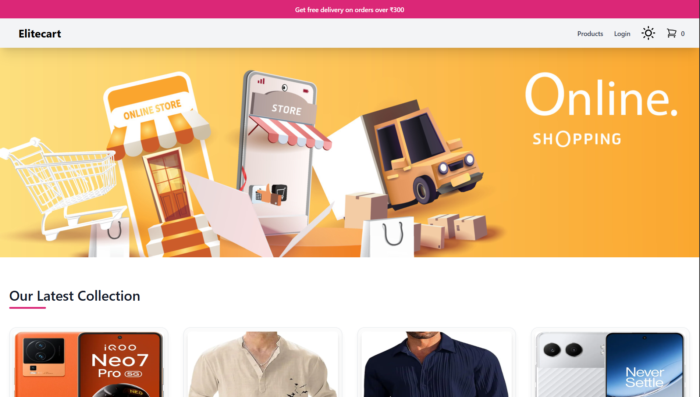
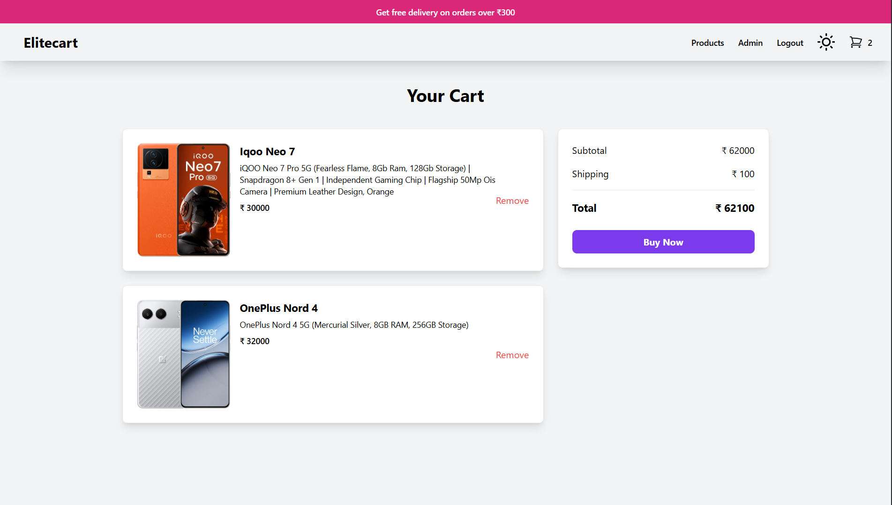
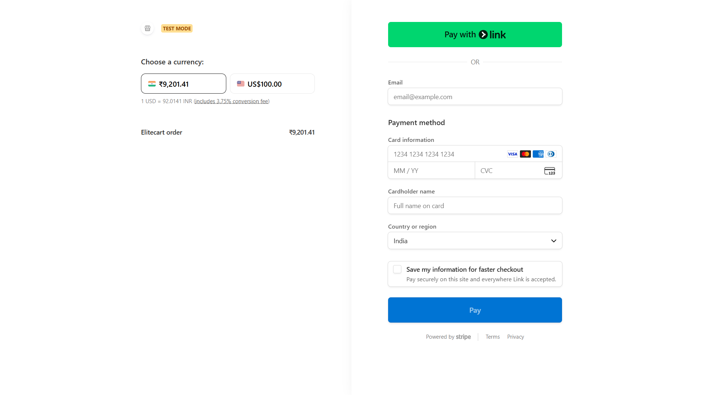
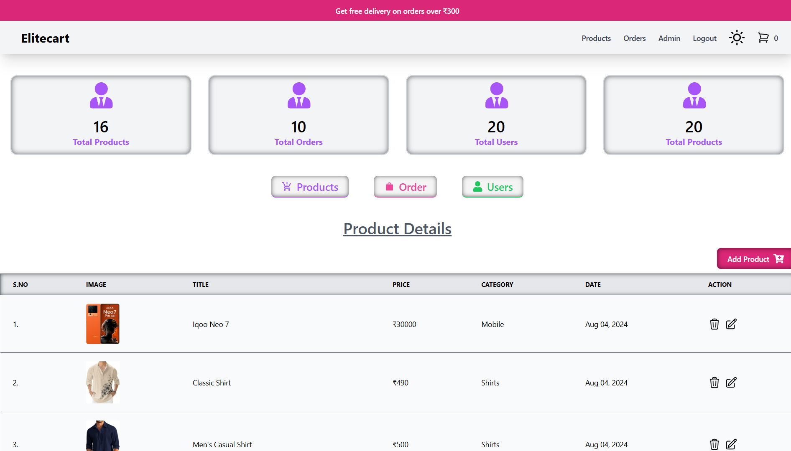

# **EliteCart — E-Commerce Web Application**

A modern, scalable, and fully-functional **e-commerce web application** built with **React (Vite)**, **Redux**, **Firebase**, and **Razorpay**.  
Designed for speed, reliability, and a smooth shopping experience — includes a complete **Admin Dashboard** for product & order management.

---

## **Badges**

<p align="left">
  
  
  
  
  
  
</p>

---

## **Live Demo**

## **Website:** 

## **Demo (GIF)**

Add a short GIF showing Homepage → Product → Cart → Payment → Success.

```

```

--

## **Features**

### **User Side**

- Authentication (Email / Google)
- Add to cart, manage cart items
- Secure online payments (Razorpay)
- Fully responsive user interface

### **Admin Dashboard**

- Add, edit & delete products
- Manage users and orders
- Realtime product & order updates (via Firebase)
- Lightweight, clean, and fast UI

---

## **Tech Stack**

- **React + Vite**
- **Redux** (Global state management)
- **Firebase** (Auth + Firestore)
- **Razorpay** (Payment gateway)
- **TailwindCSS**

---

## **Screenshots**

Replace with your actual screenshots:

```




```

---

## **Getting Started**

### **1. Clone the repo**

```bash
git clone https://github.com/Deepakk2104/EliteCart--E-commerce-Web.git
cd EliteCart--E-commerce-Web
```

### **2. Install dependencies**

```bash
npm install
```

### **3. Start development server**

```bash
npm run dev
```

---

## **Project Structure**

```
EliteCart--E-commerce-Web/
│
├── public/
├── src/
│   ├── admin/
│   ├── components/
│   ├── pages/
│   ├── redux/
│   ├── firebase/
│   ├── assets/
│   ├── App.jsx
│   └── main.jsx
│
├── package.json
├── vite.config.js
└── README.md
```

---

## **Build for Production**

```bash
npm run build
```

Deploy the `dist/` folder using:

- Vercel
- Firebase Hosting
- Netlify

---

## **Contributing**

Contributions are welcome.

1. Fork the project
2. Create your feature branch
3. Commit changes
4. Open a Pull Request

---

## **License**

Licensed under the **MIT License**.

---

## **Author**

**Developed by [Deepakk2104](https://github.com/Deepakk2104)**
